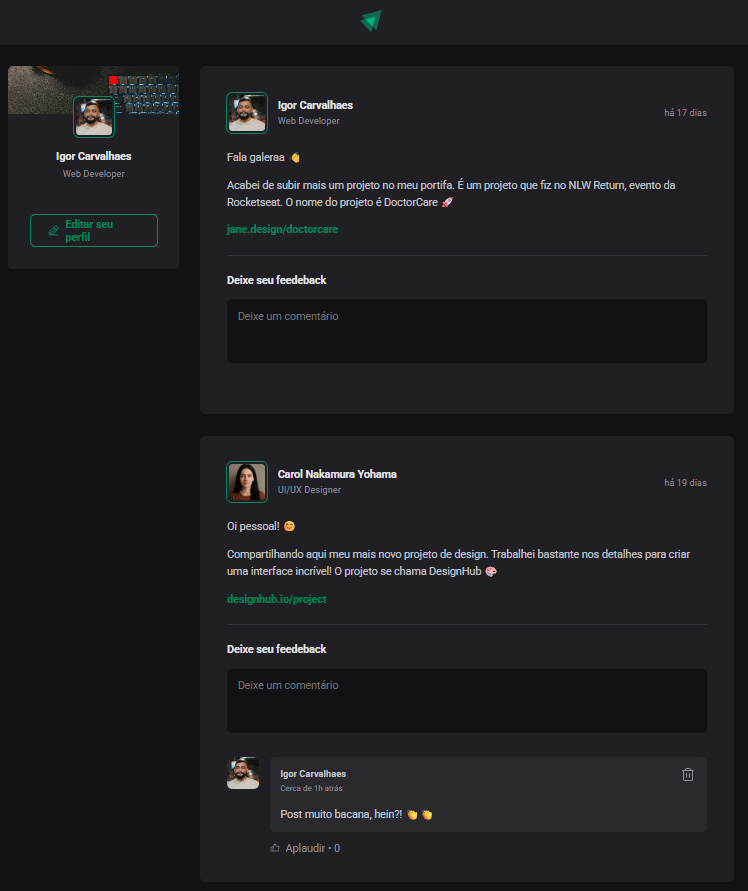

# IgniteFeed

[](LICENSE) [](https://reactjs.org/) [](https://vitejs.dev/) [](https://www.typescriptlang.org/)

> A feed application built during Rocketseat’s Ignite ReactJS Fundamentals module. In this project, you will learn and apply core React concepts such as componentization, props, state management, immutability, and hooks, all with TypeScript support.

## Table of Contents

- [Demo](#demo)
- [Features](#features)
- [Tech Stack](#tech-stack)
- [Getting Started](#getting-started)
- [Project Structure](#project-structure)
- [License](#license)

## Demo



## Features

- Display a list of posts with author info and published date.
- Add and delete comments on posts.
- Format dates (relative and absolute) using **date-fns**.
- Responsive design for both desktop and mobile.

## Tech Stack

- **React**
- **TypeScript**
- **Vite**
- **CSS Modules**
- **date-fns** for date formatting
- **Phosphor Icons** for UI icons

## Getting Started

1. **Clone the repository**

   ```bash
   git clone https://github.com/<username>/ignite-feed.git
   ```

2. **Install dependencies**
   ```bash
   cd ignite-feed
   npm install
   ```
3. **Run the development server**
   ```bash
   npm run dev
   ```
4. **Open your browser**

## Project Structure

```bash
ignite-feed/
├── public/
│   └── preview.png       # Project preview image
├── src/
│   ├── components/       # Reusable UI components
│   ├── assets/           # Project logo and profile imgs
│   ├── App.tsx           # Root component
│   └── main.tsx          # Entry point
├── .gitignore
├── index.html
├── package.json
├── tsconfig.json
└── vite.config.ts
```

## License

Distributed under the MIT License.
